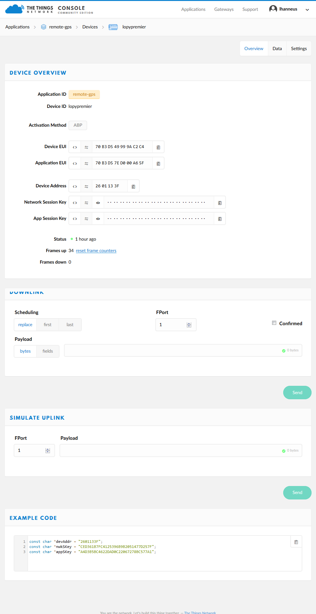
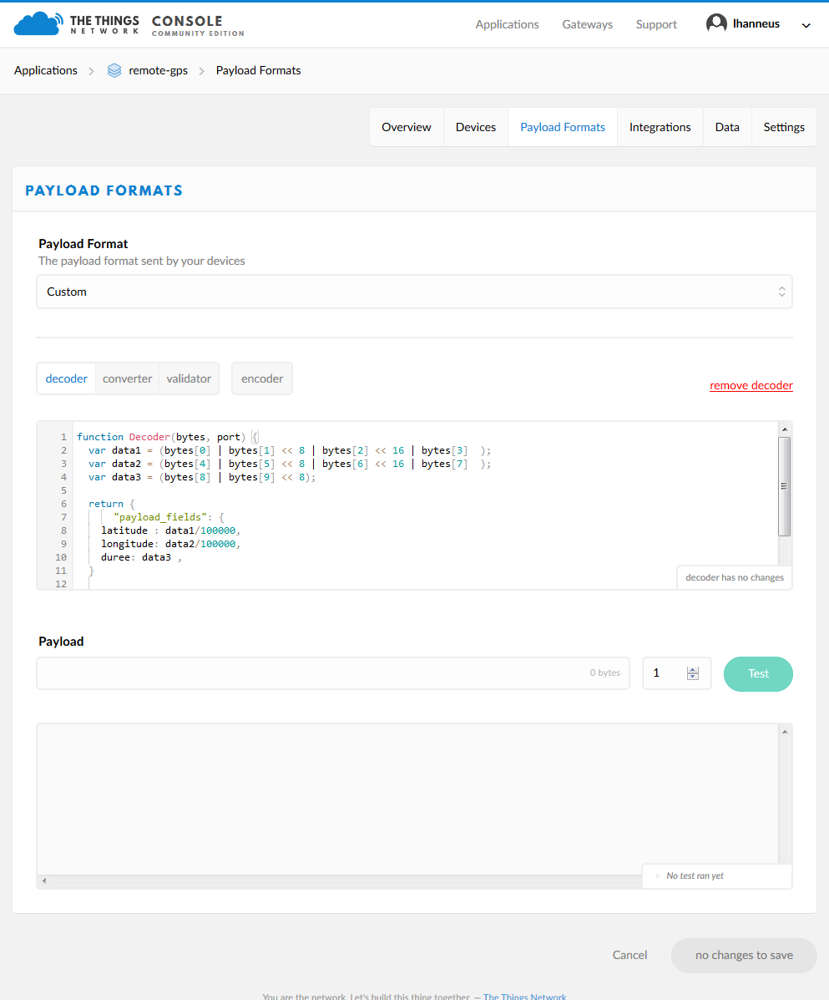
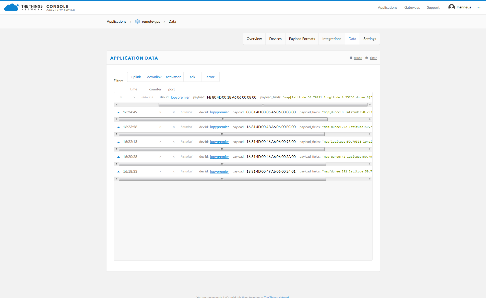

# PyTrack-GPS-LoPy-TTN-HA_tracker

This project link a GPS tracker that sends it's coordinate by LoRa trought the TTN (The things Network), TTN decodes the payload then send it by MQTT. Home Assitant receive that MQTT message trought an JSON MQTT Device Tracker Component, you can then see it on your map or program differents interactions. Then it send another MQTT message in a format compatible with owntrack, so you can see your position throught any owntrasks device (iphone, android, custom software) and if you want you can share that message to friends.

You need :
* a LoPy or LoPy4 from Pycom https://pycom.io/product/lopy/
* a Pytrack from Pycom https://pycom.io/hardware/pytrack-specs/
* a TTN acount https://console.thethingsnetwork.org/
* a working Home Assistant (HA) system with a functionning MQTT broker : https://home-assistant.io/
* optional an owntracks application that display the postion : http://owntracks.org/

In the pycom folder, the program to run on the LoPy attached to a Pytrack. Replace the wifi ssid, wifi password and all the ABP lora : dev_addr, nwk_swkey, app_swkey. You'll find those information in your TTN device page.

  

In the TTN folder, the code to insert in your payload decoder

  

You should see decoded data now in your TTN application page.

  

In the HA folder, some lines to add to your configuration.yaml and to your automation.yaml
replace remote-gps/devices/lopypremier/up/payload_fields by your application ID (here remote-gps) and device ID (here lopypremier)

In the mosquitto folder, some lines to bridge your MQTT broker with the TTN broker
add those lines in your /etc/mosquitto/mosquitto.conf file, it will bridge your MQTT broker to the TTN broker to get the messages. Replace remote_password ttn-account-v2.1000000000000000000000000000000000000000000000000 by your own Application access keys and topic remote-gps/devices/lopypremier/up by your application ID (here remote-gps) and device ID (here lopypremier)

ToDo: 
* have function to get time from the gps and send it.
* get the accuracy from the gps and send it.
* change the tst function to generate a correct time with HA or get it from the device